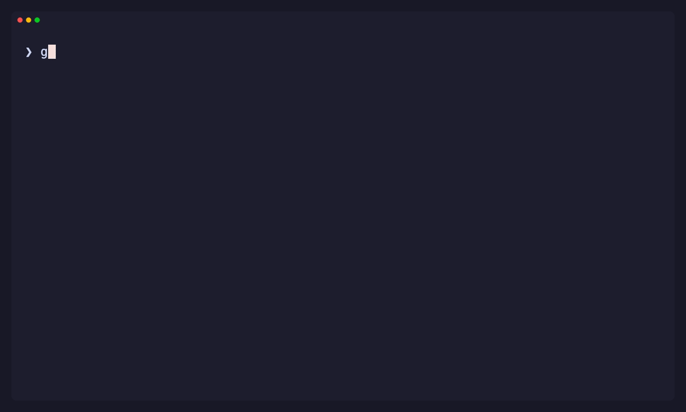

# Gambit

Gambit is a high-performance PGN inspection and validation tool backed by a
dependency-free ingestion layer and a compact semantic chess core.

[Read the documentation](https://diegoglozano.github.io/gambit/docs/) or
[download the latest release](https://diegoglozano.github.io/gambit/artifacts/).



## Gambit databases

Build a self-contained chess database when you want to query the same corpus
repeatedly:

```shell
gambit index ./diegoglozano-games --output diegoglozano.gambit

# After the next sync, add new games and replace changed ones in place.
gambit index --update ./diegoglozano-games --output diegoglozano.gambit

gambit info diegoglozano.gambit

gambit query diegoglozano.gambit \
  --player diegoglozano \
  --color black \
  --result loss \
  --since 2026-01-01 \
  --format count
```

The `.gambit` file contains the original PGN, normalized metadata, and an exact
mainline-position lookup. Count queries read indexes without decompressing PGN;
PGN output extracts only matching games. Construction streams plain PGN,
`.pgn.zst`, standard input, or recursive directories with memory bounded by one
game and a fixed database cache. Incremental updates scan source fingerprints,
skip unchanged files before chess-semantic work, and commit every addition or
replacement in one transaction. See the
[database guide](https://diegoglozano.github.io/gambit/docs/databases/) for
inspection, integrity checks, format details, and HPC tradeoffs.

## Gambit Sync

Maintain a resumable local collection of a Lichess user's games:

```shell
gambit sync \
  --lichess-user diegoglozano \
  --output ./diegoglozano-games \
  --database diegoglozano.gambit

gambit stats ./diegoglozano-games
gambit query diegoglozano.gambit \
  --player diegoglozano \
  --result loss \
  --format count
```

Sync stores one PGN per stable Lichess game ID. Later runs fetch only an
overlapping incremental window and refresh games that were previously
unfinished. Interrupted runs retain their last committed cursor and can be
retried safely. With `--database`, the first successful sync builds a `.gambit`
file and every later sync updates only new or changed game sources. See the
[Sync guide](https://diegoglozano.github.io/gambit/docs/sync/) for authentication,
storage, and automation details.

## Gambit Query

Search a PGN corpus by chess position or player-relative metadata:

```shell
gambit query --lichess-user diegoglozano \
  --color black \
  --result loss \
  --since 2026-01-01 \
  --format count

gambit query games.pgn \
  --player diegoglozano \
  --color black \
  --result loss \
  --since 2026-01-01 \
  > black-losses.pgn

gambit query games.pgn --player diegoglozano --format count

gambit query games.pgn \
  --position 'rnbqkbnr/pppp1ppp/8/4p3/4P3/8/PPPP1PPP/RNBQKBNR w KQkq - 0 2' \
  --format count
```

Query emits matching PGN by default, so its output remains usable by Gambit or
other chess software. `--lichess-user` reads the user's public games directly
from the Lichess API without creating a local archive; an optional
`LICHESS_TOKEN` enables authenticated access. JSONL exposes one metadata record
per match for data pipelines. Player and opponent names are matched
case-insensitively; color, win/loss, and rating filters are evaluated from the
selected player's perspective. Position search executes standard-chess
mainlines and reports each matching game once, even if the position occurs
repeatedly.

Plain files, `.pgn.zst` streams, recursive directories, and standard input are
supported. Query retains at most one game up to the 16 MiB safety limit, so
memory use is independent of corpus size. See the
[Query guide](https://diegoglozano.github.io/gambit/docs/query/) for filters,
output contracts, and examples.

## Gambit Stats

Inventory a plain or Zstandard-compressed PGN corpus in one streaming,
bounded-memory pass:

```shell
gambit stats games.pgn.zst
gambit stats ./sharded-corpus
gambit stats --format json january.pgn february.pgn.zst
```

Stats reports decompressed bytes, complete games, mainline plies, result and
game-length distributions, Seven Tag Roster coverage, complete date range, and
Elo coverage/range/average. Fixed buckets show game-length and rating shape,
while time-control categories distinguish sudden-death, increment, staged, and
other PGN forms. Recursive-variation moves are excluded. Stats is deliberately
lexical and does not execute moves; use Doctor when chess-semantic validity
matters.

The hot path uses fixed-size counters over the fused incremental parser. Input
is read once with a 64 KiB reusable buffer, memory does not grow with corpus
size, and `.pgn.zst` is decompressed in-process. See the
[Stats guide](https://diegoglozano.github.io/gambit/docs/statistics/) for metric
semantics, JSON output, partial results, and HPC behavior.

## Gambit Doctor

Release archives and installers are built for Linux, macOS, and Windows. On
Linux or macOS, install the latest release with:

```shell
curl --proto '=https' --tlsv1.2 -LsSf \
  https://github.com/diegoglozano/gambit/releases/latest/download/gambit-installer.sh | sh
```

On Windows PowerShell:

```shell
powershell -ExecutionPolicy Bypass -c "irm https://github.com/diegoglozano/gambit/releases/latest/download/gambit-installer.ps1 | iex"
```

See the [changelog](https://diegoglozano.github.io/gambit/changelog/) for release
highlights and upgrade notes.

Diagnose the syntax and chess semantics of plain or Zstandard-compressed PGN
files. Doctor recognizes `.zst` by filename, so no external decompressor is
needed:

```shell
gambit doctor games.pgn
gambit doctor games.pgn.zst
gambit doctor january.pgn february.pgn.zst
gambit doctor ./corpus
```

Directory inputs are scanned recursively for files ending in `.pgn` or
`.pgn.zst`, case-insensitively. Files are processed in deterministic path order,
so the same corpus produces reports in the same order across runs. Other files
are ignored.

Use `-` alone to read decompressed PGN from standard input. Standard input
cannot be mixed with file paths in the same invocation.

Doctor reports malformed PGN, invalid FEN starting positions, malformed or
illegal SAN, ambiguous moves, and incorrect check or mate suffixes. Semantic
mode also verifies that `Result` matches the movetext outcome, `SetUp` and `FEN`
appear together correctly, and explicit move numbers match the live position
and side to move. These cross-field checks include recursive variations and FEN
starts; `--syntax-only` intentionally skips them.

Diagnostics include the game number and identifying headers, ply, byte offset,
line, column, and a source-line excerpt. Lines and byte columns are one-based.
Doctor exits with status 0 for valid input, 1 for invalid chess data, 2 for
command-line usage errors, and 3 for input or reporting failures.

By default Doctor stops at the first error, preserving its fastest streaming
path. Use `--keep-going` to scan later outcome-delimited games (up to 100
diagnostics), or set an explicit positive limit with `--max-errors`. JSON keeps
the first diagnostic in `diagnostic` for compatibility and places later ones in
`additional_diagnostics`; JSONL emits one diagnostic record per line followed
by a summary record.

For multiple inputs—including files discovered under a directory—the error
limit applies independently to each file and the process returns the most
severe exit status. JSON wraps the per-file reports in a batch summary. JSONL
emits each file's records followed by a final `batch_summary` record.
Single-input JSON remains unchanged. An empty directory is reported as an input
error instead of silently succeeding.

Use machine-readable output in scripts, check only PGN structure, allow a
missing final outcome marker, or suppress a successful report:

```shell
gambit doctor --format json games.pgn
gambit doctor --keep-going --format jsonl games.pgn
gambit doctor --keep-going --format github ./corpus
gambit doctor --max-errors 20 games.pgn
gambit doctor --syntax-only games.pgn
gambit doctor --lenient fragment.pgn
gambit doctor --quiet games.pgn
```

The `github` format emits native error annotations when Doctor runs in GitHub
Actions. See the [GitHub Actions guide](https://diegoglozano.github.io/gambit/docs/github-actions/)
for a copy-paste workflow.

The original `gambit games.pgn` form remains available as a compatibility
alias for semantic validation.

## Parser design

- Single-pass pull parser over `&[u8]`
- Zero allocation on the hot path; every tag, SAN move, and comment borrows the
  original input
- Structural events for headers, move numbers, SAN, NAGs, comments, recursive
  annotation variations, and outcomes
- Fused single-pass parsing from files, pipes, or decompression streams with
  bounded memory
- Borrowed streaming events delivered through a callback, without rescanning
  framed games
- Byte-accurate spans and errors
- Strict and lenient modes
- No chess-position work in the parsing layer

```rust
use gambit_pgn::{Event, Parser};

let pgn = b"[Event \"Example\"]\n\n1. e4 e5 2. Nf3 *";
for event in Parser::new(pgn) {
    match event? {
        Event::San(token) => println!("SAN: {}", token.as_str()?),
        _ => {}
    }
}
# Ok::<(), Box<dyn std::error::Error>>(())
```

Run the test suite:

```shell
cargo test --workspace
```

Measure parser throughput on the built-in synthetic corpus, or pass a real PGN
file:

```shell
cargo run --release -p gambit-pgn --example throughput
cargo run --release -p gambit-pgn --example throughput -- games.pgn
```

Validate a corpus and print structural counts:

```shell
cargo run --release -p gambit-pgn --example validate -- games.pgn
```

Parse a decompressed file with bounded memory, or decompress and parse in one
pipeline. This is the preferred high-throughput streaming path:

```shell
cargo run --release -p gambit-pgn --example incremental-validate -- games.pgn
zstdcat games.pgn.zst | \
  cargo run --release -p gambit-pgn --example incremental-validate -- -
```

The older two-pass game-framing benchmark remains available for comparison:

```shell
cargo run --release -p gambit-pgn --example stream-validate -- games.pgn
zstdcat games.pgn.zst | \
  cargo run --release -p gambit-pgn --example stream-validate -- -
```

The first real-corpus baseline uses 810,463 standard-rated Lichess games. See
[the April 2014 benchmark report](https://diegoglozano.github.io/gambit/docs/benchmarks/lichess-2014-04/)
for the dataset checksum, reproducible commands, python-chess and Scoutfish
comparison, results, and measurement limitations.

The parser remains lexical by design. `gambit-chess` owns legality and
position-dependent meaning so ingestion and chess-state work stay independently
optimizable.

## Documentation development

Build the Oranda landing page and MkDocs guide into `public/`:

```shell
python -m pip install --requirement requirements-docs.txt
oranda build
mkdocs build --strict
python -m http.server --directory public
```

The terminal demo is generated from the release-mode CLI with
[VHS](https://github.com/charmbracelet/vhs):

```shell
cargo build --release -p gambit
vhs demo/gambit-doctor.tape
```

## Semantic chess core

`gambit-chess` adds 104-byte copyable bitboard positions, 32-bit moves, FEN
loading, legal move generation, and SAN execution. It handles pins, checks,
castling, en passant, promotion, and file/rank disambiguation without external
dependencies.

Run a reproducible legal-move-generation benchmark from the initial position;
the optional arguments are depth followed by a FEN:

```shell
cargo run --release -p gambit-chess --example perft -- 6
cargo run --release -p gambit-chess --example perft -- 5 \
  'r3k2r/p1ppqpb1/bn2pnp1/3PN3/1p2P3/2N2Q1p/PPPBBPPP/R3K2R w KQkq - 0 1'
```

Validate every SAN move while incrementally reading a PGN corpus:

```shell
cargo run --release -p gambit-pgn --example semantic-validate -- games.pgn
zstdcat games.pgn.zst | \
  cargo run --release -p gambit-pgn --example semantic-validate -- -
```

On the April 2014 Lichess corpus, the current single-threaded semantic path
validates 54,748,499 moves at a median 11.43 million moves/s on an Apple M3, with
approximately 1.79 MB maximum RSS.

An experimental bounded parallel path frames complete games into packed byte
batches and validates each batch on worker-local chess state. The optional
arguments select the worker count and target batch size in MiB; defaults are
the available hardware parallelism and 1 MiB:

```shell
cargo run --release -p gambit-pgn \
  --example parallel-semantic-validate -- games.pgn 4 1
```

Sweep worker counts on the same decompressed corpus to measure strong scaling:

```shell
cargo build --release -p gambit-pgn --example parallel-semantic-validate
for workers in 1 2 4 8; do
  target/release/examples/parallel-semantic-validate games.pgn "$workers" 1
done
```

The queue holds at most twice the worker count in pending batches. Games larger
than the batch target remain intact, so the existing 16 MiB `GameReader` limit
is still the per-game upper bound. This path intentionally uses the lightweight
game framer before worker-local parsing. The file-oriented experiment below
tests direct game-aligned range partitioning without that serial validation
stage.

The experimental partitioned path performs a bounded boundary-discovery pass,
then lets each worker seek to and validate an independent game-aligned range:

```shell
cargo run --release -p gambit-pgn \
  --example partitioned-semantic-validate -- games.pgn 4
```

It reports partitioning and validation time separately. On the Intel N95,
direct validation was only slightly faster than the queue path. On the Apple M3,
eight direct ranges validate faster than the four-worker queue, but the discovery
pass still makes a one-shot run slower. Persisted boundaries amortize after
approximately four repeated M3 analyses.

## License

Gambit is available under either the
[MIT License](https://github.com/diegoglozano/gambit/blob/main/LICENSE-MIT) or
the [Apache License 2.0](https://github.com/diegoglozano/gambit/blob/main/LICENSE-APACHE),
at your option.
